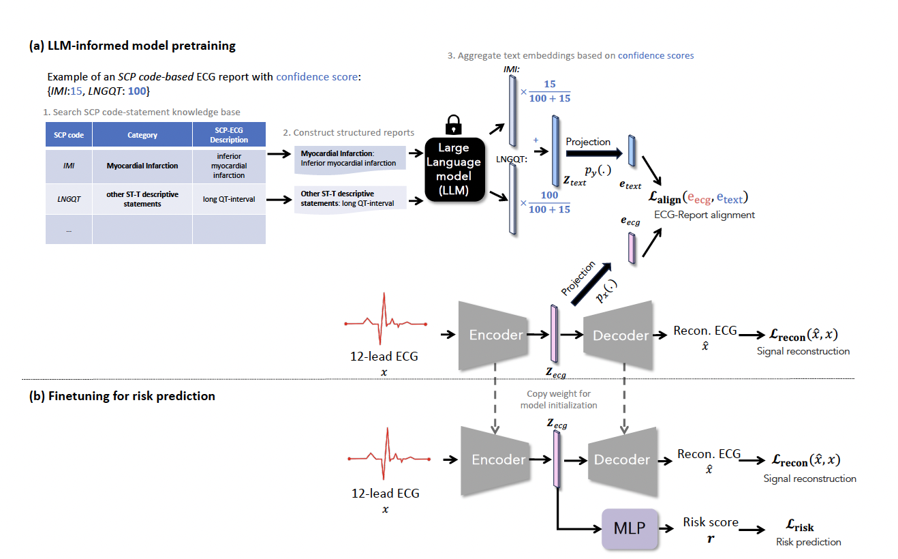
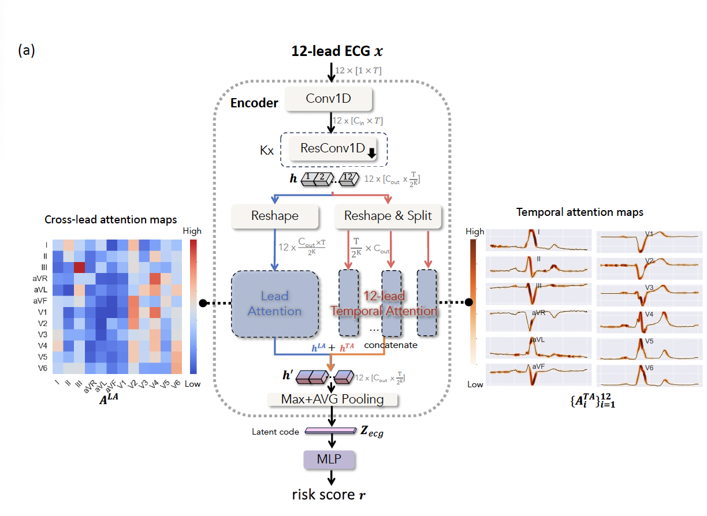

# LLM-ECG-Dual-Attention

[IEEE trans. on Big Data, 2024] [Large Language Model-informed ECG Dual Attention Network for Heart Failure Risk Prediction](https://arxiv.org/abs/2403.10581).


If you find the code useful, please cite
```
@ARTICLE{Chen2024-ea,
  title         = "Large Language Model-informed {ECG} Dual Attention Network
                   for Heart Failure Risk Prediction",
  author        = "Chen, Chen and Li, Lei and Beetz, Marcel and Banerjee,
                   Abhirup and Gupta, Ramneek and Grau, Vicente",
  year          =  2024,
  journal = "IEEE trans. on Big Data"
}
```
or 
```
Chen C, Li L, Beetz M, Banerjee A, Gupta R, Grau V. Large Language Model-informed ECG Dual Attention Network for Heart Failure Risk Prediction. IEEE. trans on Big Data. 2024. Available: http://arxiv.org/abs/2403.10581
```
## Overview:
Heart failure (HF) poses a significant public health challenge, with a rising global mortality rate. Early detection and prevention of HF could significantly reduce its impact. In this study, we introduce a novel methodology for predicting HF risk using 12-lead electrocardiograms (ECGs) with a focus on **robustness** and **explainability**. Specifically, we leverage a large language model (LLM) with a public ECG-report dataset for pretraining on an ECG-report alignment task.  Our LLM-informed pretraining can handle `labeling uncertainty` and `mixed languages in the dataset` while ensuring pathologically informed representation learning. See below and paper for more details. The network is then fine-tuned for HF risk prediction using two specific cohorts from the UK Biobank study: patients with hypertension (UKB-HYP) and those who have had a myocardial infarction (UKB-MI).



 To enhance explainability, we present a novel, lightweight dual-attention ECG network featuring a cross-lead attention module and twelve lead-specific temporal attention modules, which can visualize cross-lead interactions and each lead's local dynamics. See below. 
 

 The results reveal that LLM-informed pretraining substantially enhances HF risk prediction in these cohorts. The dual-attention design not only improves interpretability but also predictive accuracy, outperforming existing competitive methods with C-index scores of 0.6349 for UKB-HYP and 0.5805 for UKB-MI. This demonstrates our method's potential in advancing HF risk assessment using clinically complex ECG data.


## Key Features
- [x] **Explainable ECG Dual Attention Network**: A novel, lightweight ECG dual attention framework that visualizes cross-lead and temporal attention simultaneously for explainable AI solution. 
    ### Quick start: 
    - Initialize an instance with:
        ```python
        from multi_modal_heart.model.ecg_net_attention import ECGAttentionAE
        ecg_net = ECGAttentionAE(num_leads=n_leads, time_steps=max_seq_len, 
                                z_dims=512, 
                                linear_out=512, 
                                downsample_factor=5, 
                                base_feature_dim=4,
                                if_VAE=False,
                                use_attention_pool=False,
                                no_linear_in_E=True)
        ```
    - More code on how to visualize the attention maps can be found in jupyter notebooks: 
        - [multi_modal_heart/tasks/vis_risk_score_attention_maps.ipynb](multi_modal_heart/tasks/vis_risk_score_attention_maps.ipynb)
        - [pdf for online quick look](multi_modal_heart/tasks/vis_risk_score_attention_maps.pdf) 
- [x] **Robust Risk Prediction**: We stabilize the training with optimized data loader based on [StratifiedBatchSampler](https://github.com/cherise215/LLM-ECG-Dual-Attention/blob/ad2560d0788e854e5fd4d964bcc3840290824671/multi_modal_heart/tasks/train_risk_regression_model_with_recon_task.py#L119). This ensures that each batch shares the similar data distribution. This is important due to the scarse of heart failure event. Without this, some batches may have zero heart failure event, then there is no way to compute the harzard risk loss.  We also replace standard dropout with [BatchwiseDropout](https://github.com/cherise215/LLM-ECG-Dual-Attention/blob/ad2560d0788e854e5fd4d964bcc3840290824671/multi_modal_heart/model/custom_layers/fixable_dropout.py#L77C7-L77C23) for risk prediction tasks. `BatchwiseDropout` applies the same feature masking to all subjects within a batch. In this way, it ensures a fair comparison between risk scores obtained using masked features from censored and uncensored subjects in a batch. 
- [x] **Reliable Large Language Model Guided Structured Text Embedding Generation**: Utilizes large language models to generate structured text embeddings from ECG reports. To effectively handle uncertainty and bilingual data, we use unified ECG-SCP codes to construct SCP-code-based statements, including their categories and detailed definitions, as a way to inject medical knowledge. Each report may contain multiple codes (pathologies), and each code is associated with an uncertainty score. Therefore, for each report, we perform confidence-based reweighting to aggregate text embeddings with the associated different SCP codes. For interested researchers, step-by-step tutorial on how we generate these embeddings can be found at: [toolkits/generate_ptb_scp_with_confidence_embeddings.ipynb](https://github.com/cherise215/LLM-ECG-Dual-Attention/blob/dev/toolkits/generate_ptb_scp_with_confidence_embeddings.ipynb). 


## Project structure
- `data`: Raw and processed data
    - `ptxbl`[Dowload](https://drive.google.com/file/d/1FkCoGAfMeg2dmOSBYDljW8mVp9Rli9W4/view?usp=sharing)
    - `ukb` 
- `multi_modal_heart`:  Core code base
    - `model`: for all networks, layers
    - `tasks`: *main files for pretraining and finetuning* as well as visualization of attentions.
    - `ECG`: code for ECG loading and pre-processing.
    - `common`: common utils
- `pretrained_weights`: Pretrained model weights.[Download](https://drive.google.com/drive/folders/1j6qbuQYjJJ4yn_zz4aHZdQRrvuFUJ7pS?usp=sharing)
    - `model`: folder for pretrained ECG network weights
    -  `text_embeddings`: folder contains text embeddings extracted from LLMs. 
- `result`:  Results of the experiments with risk prediction models. Please email Chen with reasonable request. 
- `toolkits`: Toolkit scripts and utilities
    - generate_ptb_scp_with_confidence_embeddings.ipynb # Example of a Jupyter notebook for LLM-based text embedding processing
- `requirements.txt`: Python dependencies


## Set Up
- Git clone this project: 
`git clone https://github.com/cherise215/LLM-ECG-Dual-Attention.git`
- (optional) Create a fresh Python 3.9.x virtual environment. [guide](https://www.arch.jhu.edu/python-virtual-environments/)
- Install PyTorch with CUDA support for GPU-enabled computation. [check official guide for pytorch installation here](https://pytorch.org/). In our settings, we use Pytorch 1.13.0, cuda version 12.2, Driver Version: 535.183.01, hardware: GTX TITAN X. 
`pip3 install torch torchvision torchaudio`
- Install other required python libraries with: 
 `pip install -r requirements.txt`

## Preparation:
Here are some basic steps to run the project:
- Data Preparation: Ensure that your data is put in the the appropriate directories under data/. For example, PTXBL data should be in `[project folder]/data/ptxbl` [Dowload post-processed one via Google Drive](https://drive.google.com/file/d/1FkCoGAfMeg2dmOSBYDljW8mVp9Rli9W4/view?usp=sharing) or official websites [PTB-XL](https://physionet.org/content/ptb-xl/1.0.3/) for report information and [PTB-XL+](https://physionet.org/content/ptb-xl-plus/1.0.1/) for median wave information. For UK biobank data, unfortunately, we cannot directly share the data due to the UK biobank's strict data sharing policy. 

- Download pretrained models and saved structured text embeddings using ClinicalBert for all the patients with verified reports in PTB-XL [link](https://drive.google.com/drive/folders/1j6qbuQYjJJ4yn_zz4aHZdQRrvuFUJ7pS?usp=sharing). Please put it as `[project folder]/pretrained_weights/`. For interested researchers, step-by-step tutorial on how we generate these embeddings can be found at: `toolkits/generate_ptb_scp_with_confidence_embeddings.ipynb`. 

## Task 1: Pretraining 
-  LLM_informed Pretraining of ECG dual attention network using PTB-XL data, see `multi_modal_heart/tasks/pretrain.py`. Please ensure that you have downloaded the weights [from G-drive](https://drive.google.com/drive/folders/1j6qbuQYjJJ4yn_zz4aHZdQRrvuFUJ7pS?usp=sharing) and save it at: `path/to/LLM-ECG-Dual-Attention/pretrained_weights/text_embeddings/PTBXL_LLM_scp_structed_text_embedding.pkl` 

To start training/finetuning, simply run: 
    ```console
    CUDA_VISIBLE_DEVICES=0 python multi_modal_heart/tasks/pretrain.py --ae_type "ECG_attention_512" --ECG2Text  --use_median_wave  --warm_up
    ```

## Task 2: Heart Failure Risk Prediction 
- You can train the model using your own datasets or our datasets (note: while UK biobank is a public dataset, it has a strict data sharing policy. Users must apply to get access. We can only share the UK Biobank data to the collaborators within the same application. check [UK biobank access policy](https://www.ukbiobank.ac.uk/media/llupxihh/20210309-access-procedures-v2-0-final.pdf)). 
For your own datasets, please organize it in the following format:
    - x: input ECG data vectors (n_samples, n_leads, n_time_steps)
    - y: a list of triplets (status, duration, eid). 
        - **status [int]:** Event indicator tensor, indicating whether this is a heart failure event (1) or not (0).
        - **time [int]:** Duration in days from the examination date (date of ECG) to the event time or, if there is no event, to the censoring time (date of the last database update).
        - **eid [int]:** Patient unique id.

- Robust evaluation: Due to limited of censored subjects in our case, the code will automatically perform the 2-fold cross-validation and repeat the whole training and evaluation process using different random seeds 5 times. 

- Test environment using `dummy` data, by specifying the dataset_name to `dummy`, i.e., "--dataset_name 'dummy'":
    - Train from scractch. Simply run:
    ```console
    CUDA_VISIBLE_DEVICES=0 python multi_modal_heart/tasks/train_risk_regression_model_with_recon_task.py --model_name "ECG_attention" --train_from_scratch --dataset_name "dummy"  --batch_size 128  --lr 1e-4 --n_folds 2 --latent_code_dim 512
    ```
    - Finetune the model using our LLM-pretrained model. The model checkpoint can be found at [G-drive](https://drive.google.com/drive/folders/1j6qbuQYjJJ4yn_zz4aHZdQRrvuFUJ7pS?usp=sharing).You can also use your own one by specifying `checkpoint_path`. 
    - Run the command:
      ```console
      CUDA_VISIBLE_DEVICES=0 python multi_modal_heart/tasks/train_risk_regression_model_with_recon_task.py --model_name "ECG_attention" --checkpoint_path "./pretrained_weights/model/ECG2Text/checkpoint_best_loss-v2.ckpt" --dataset_name "dummy"  --batch_size 128  --lr 1e-4 --n_folds 2 --latent_code_dim 512`
      Here the pretrained weights is located at: `Path/to/LLM-ECG-Dual-Attention/pretrained_weights/model/ECG2Text/checkpoint_best_loss-v2.ckpt
      ```
    
- Train the model with real-world datasets. Below are examples with suggested batch size configurations for reference:
      - **Small datasets:**
      For small datasets, please ensure that the batch size contains a sufficient number of censored subjects and use small batches for better model regularization. In our myocardial infarction (MI) cohort, we set the `batch_size` to 128 (`--batch_size 128`) as the total number of samples is only 800:
  
        ```console
        CUDA_VISIBLE_DEVICES=1 python multi_modal_heart/tasks/train_risk_regression_model_with_recon_task.py --model_name "ECG_attention" --train_from_scratch --dataset_name "MI_with_HF_event" --batch_size 128 --lr 1e-4 --n_folds 2 --latent_code_dim 512 --checkpoint_path "./pretrained_weights/model/ECG2Text/checkpoint_best_loss-v2.ckpt" 
        ```
        
    - **Larger datasets:**
         For larger datasets, you can consider to increase the batch size. In our hypertension dataset, we set `batch_size` to 1024:

        ``` console
        CUDA_VISIBLE_DEVICES=1 python multi_modal_heart/tasks/train_risk_regression_model_with_recon_task.py --model_name "ECG_attention" --train_from_scratch --dataset_name "HYP_with_HF_event" --batch_size 1024 --lr 1e-4 --n_folds 2 --latent_code_dim 512 --checkpoint_path "./pretrained_weights/model/ECG2Text/checkpoint_best_loss-v2.ckpt" 
        ```
## Traditional risk prediction based on Cox’s proportional hazard model using 15 ECG biomarkers/measurements:
- We also provide code to train a Cox’s proportional hazard model using 15 clinically identified ECG measurements/biomarkers:. Check [multi_modal_heart/tasks/survival_cox_reg_model_with_biomarkers.ipynb](multi_modal_heart/tasks/survival_cox_reg_model_with_biomarkers.ipynb)


## Visualizations:
- [`multi_modal_heart/tasks/vis_risk_score_attention_maps.ipynb`](multi_modal_heart/tasks/vis_risk_score_attention_maps.ipynb) [(PDF)](https://github.com/cherise215/LLM-ECG-Dual-Attention/blob/dev/multi_modal_heart/tasks/vis_risk_score_attention_maps.pdf): Step-by-step tutorials on the visualization of the dual attention maps.

- [`multi_modal_heart/tasks/vis_risk_score_feature_distribution.ipynb`](https://github.com/cherise215/LLM-ECG-Dual-Attention/blob/dev/multi_modal_heart/tasks/vis_risk_score_feature_distribution.pdf): Visualizes the last hidden layer's feature distribution between low-risk and high-risk groups.

- [`multi_modal_heart/tasks/vis_risk_score_and_survival_curves.ipynb`](multi_modal_heart/tasks/vis_risk_score_and_survival_curves.ipynb): Visualizes the average risk scores with models from the above two-fold cross-validaton (fivetimes) and plot kaplan meier curve

## Contact
For any questions or issues, please contact [Chen Chen] at [work.cherise@gmail.com]. Thank you for checking out our project!